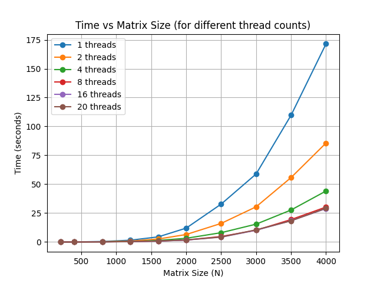

# Лабораторная работа №2

## Параллельное умножение матриц с использованием OpenMP

---

## Задание

Модифицировать программу из лабораторной работы №1 для параллельной работы с использованием технологии OpenMP. Провести серию экспериментов с различным количеством потоков (1, 2, 4, 8, 16, 20) и различными размерами матриц (200, 400, 800, 1200, 1600, 2000, 2500, 3000, 3500, 4000).

---

## Ход работы

В ходе выполнения лабораторной работы исходная программа умножения матриц была модифицирована с использованием технологии OpenMP.

Параллелизация была реализована с помощью директивы:

```cpp
#pragma omp parallel for collapse(2)
```

Распараллеливание производилось по двум внешним циклам, что позволило более эффективно распределить вычислительную нагрузку между потоками.

Была проведена серия экспериментов с различным количеством потоков и размерами матриц.

---

## Оборудование

Тестирование проводилось на ПК со следующими характеристиками:

* ОС: Arch Linux
* Процессор: Intel Core i7-12700H (14 ядер, 20 потоков)
* Компилятор: GCC
* Поддержка OpenMP: встроенная (флаг `-fopenmp`)
* Количество доступных потоков: до 20

---

## Результаты экспериментов

| Размер | 1 поток | 2 потока | 4 потока | 8 потоков | 16 потоков | 20 потоков |
| ------ | ------- | -------- | -------- | --------- | ---------- | ---------- |
| 200    | 0.0078  | 0.0037   | 0.0020   | 0.0011    | 0.0007     | 0.0017     |
| 400    | 0.0371  | 0.0242   | 0.0156   | 0.0162    | 0.0122     | 0.0107     |
| 800    | 0.4134  | 0.2151   | 0.1177   | 0.0921    | 0.0736     | 0.0935     |
| 1200   | 1.5236  | 0.7674   | 0.3966   | 0.3095    | 0.2795     | 0.3236     |
| 1600   | 4.4093  | 2.5509   | 1.3302   | 0.7893    | 0.7266     | 0.8868     |
| 2000   | 12.005  | 6.4628   | 3.1906   | 1.6677    | 1.6655     | 1.7672     |
| 2500   | 32.792  | 16.0666  | 8.0349   | 4.7395    | 4.1912     | 4.2897     |
| 3000   | 58.864  | 30.4442  | 15.4282  | 10.165    | 10.165     | 10.5001    |
| 3500   | 109.72  | 55.752   | 27.674   | 19.4015   | 18.3749    | 18.3185    |
| 4000   | 171.49  | 85.654   | 44.1178  | 30.2313   | 28.9133    | 29.1867    |

---

## Графики

Ниже представлен график зависимости времени выполнения от размера матриц при различном количестве потоков:



---

## Анализ результатов

На основе полученных данных можно сделать следующие выводы:

* При увеличении количества потоков время выполнения уменьшается
* Наиболее заметное ускорение наблюдается при переходе от 1 к 4–8 потокам
* После 8–16 потоков прирост производительности существенно снижается
* В некоторых случаях увеличение числа потоков приводит к ухудшению результата

Это объясняется следующими факторами:

* накладные расходы на создание и синхронизацию потоков
* ограниченная пропускная способность памяти
* конкуренция за кэш процессора

Также видно, что:

* для малых размеров матриц параллелизация малоэффективна
* для больших задач эффективность OpenMP значительно выше

---

## Вывод

В ходе выполнения лабораторной работы была успешно реализована параллельная версия алгоритма умножения матриц с использованием OpenMP.

Экспериментально подтверждено, что:

* параллелизация позволяет значительно сократить время выполнения вычислений
* эффективность зависит от размера задачи и числа потоков
* существует предел масштабируемости, после которого увеличение числа потоков не даёт прироста производительности

Таким образом, технология OpenMP является эффективным инструментом для ускорения вычислений, однако требует грамотного подбора параметров.

---
