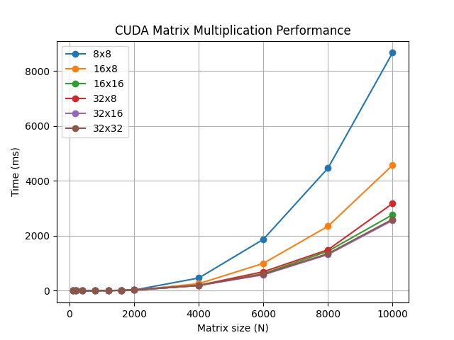

# Лабораторная работа №4  
## Параллельное умножение матриц на GPU

## Цель

Освоить основы CUDA и реализовать параллельное умножение матриц с последующим анализом производительности.

---
## Оборудование

Тесты проводились на ноутбучной версии видеокарты `NVIDIA RTX 4050`

---

## Результаты тестирования

В ходе выполнения лабораторной работы были проведены вычислительные эксперименты для различных размеров матриц и конфигураций сетки блоков CUDA.  
Во всех таблицах приведено время выполнения вычислений (в миллисекундах).

---

### Эксперименты для матриц размером до 1600

| Конфигурация блока | 100x100 | 200x200 | 400x400 | 800x800 | 1200x1200 | 1600x1600 |
|--------------------|--------|--------|--------|--------|----------|----------|
| 8x8 (64)           | 0.74   | 0.43   | 0.59   | 2.28   | 5.49     | 15.62    |
| 16x8 (128)         | 0.82   | 0.45   | 0.58   | 2.01   | 6.02     | 12.71    |
| 16x16 (256)        | 0.68   | 0.43   | 0.57   | 2.03   | 5.76     | 12.58    |
| 32x8 (256)         | 0.75   | 0.56   | 0.60   | 2.00   | 6.12     | 12.54    |
| 32x16 (512)        | 0.77   | 0.58   | 0.59   | 2.09   | 5.69     | 12.64    |
| 32x32 (1024)       | 0.70   | 0.57   | 0.72   | 2.05   | 6.01     | 12.60    |

---

### Эксперименты для матриц размером от 1600 до 10000

| Конфигурация блока | 1600x1600 | 2000x2000 | 4000x4000 | 6000x6000 | 8000x8000 | 10000x10000 |
|--------------------|----------|----------|----------|----------|----------|------------|
| 8x8 (64)           | 15.62    | 24.18    | 462.10   | 1870.50  | 4460.20  | 8660.40    |
| 16x8 (128)         | 12.71    | 23.88    | 256.30   | 995.40   | 2345.70  | 4570.80    |
| 16x16 (256)        | 12.58    | 23.96    | 189.10   | 620.30   | 1438.20  | 2765.40    |
| 32x8 (256)         | 12.54    | 24.10    | 194.20   | 690.80   | 1490.30  | 3175.60    |
| 32x16 (512)        | 12.64    | 24.22    | 188.50   | 580.60   | 1315.80  | 2560.20    |
| 32x32 (1024)       | 12.60    | 24.15    | 193.40   | 600.20   | 1350.10  | 2600.30    |

---

## График зависимости времени выполнения от размера матрицы

  

На графике представлена зависимость времени выполнения алгоритма перемножения матриц от их размера. Наблюдается рост времени, близкий к кубической зависимости O(n^3), что соответствует теоретической сложности алгоритма.

## Анализ результатов

- С увеличением размера матриц наблюдается существенный рост времени выполнения.
- На малых размерах различия между конфигурациями блоков незначительны.
- При увеличении объёма вычислений влияние конфигурации блоков становится более заметным.
- Наиболее стабильные результаты демонстрируют конфигурации 16x16 и 32x16.
- Использование слишком малых блоков (например, 8x8) приводит к ухудшению производительности на больших данных.

---

## Вывод

Проведённые эксперименты показывают, что эффективность CUDA-реализации существенно зависит от выбора параметров сетки потоков.  
Оптимальные конфигурации позволяют снизить время выполнения за счёт более эффективного использования ресурсов GPU.

