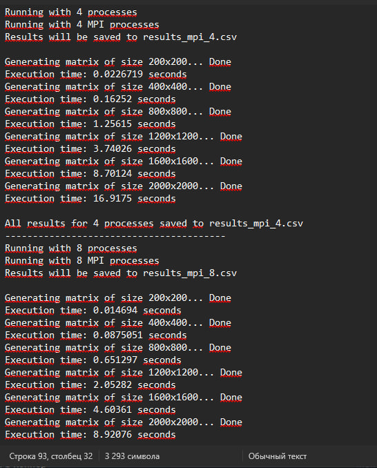
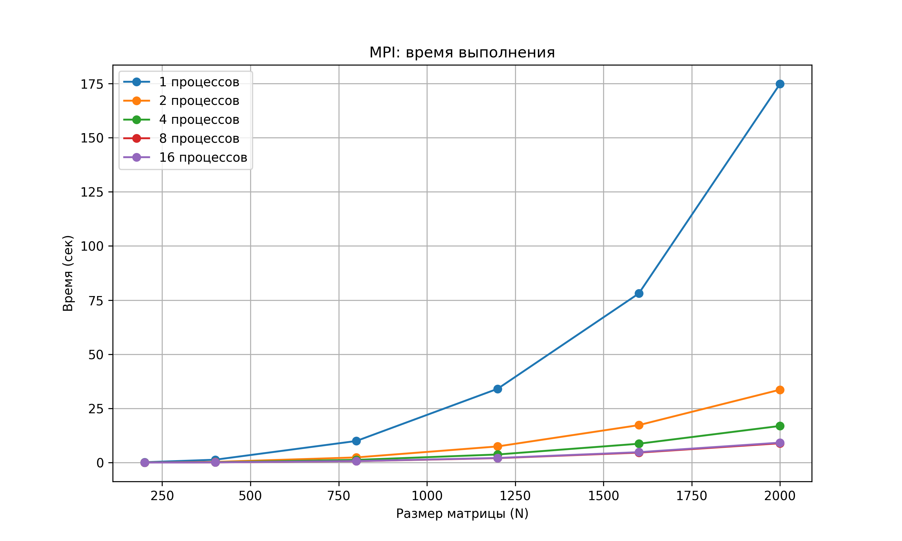

# Задание на лабораторную работу 5

Параллельную версию программы на MPI необходимо также запустить на суперкомпьютере «Сергей Королёв».

---

## Ход работы

В ходе лабораторной работы была реализована и исследована параллельная версия алгоритма перемножения квадратных матриц с использованием MPI.

Программа запускалась на суперкомпьютере «Сергей Королёв» с различным числом процессов (1, 2, 4, 8, 16) и различными размерами матриц.

Для запуска использовалась система очередей PBS. Компиляция выполнялась с помощью `mpicxx`.

Далее был создан запускной файл `start.pbs`, после чего программа была отправлена в очередь выполнения.

---

## Вывод программы на суперкомпьютере

---

## Краткое описание main.cpp

Программа инициализирует MPI, определяет количество процессов и их ранги.

Главный процесс генерирует две квадратные матрицы и распределяет данные между процессами.

Каждый процесс вычисляет часть произведения матриц.

Также фиксируется время выполнения программы.

---

## Результаты экспериментов

| Процессы \ Размер | 200  | 400  | 800  | 1200 | 1600 | 2000 |
|------------------|------|------|------|------|------|------|
| 1                | 0.15 | 1.32 | 9.97 | 34.05 | 78.06 | 174.82 |
| 2                | 0.04 | 0.31 | 2.38 | 7.45 | 17.28 | 33.64 |
| 4                | 0.02 | 0.16 | 1.25 | 3.74 | 8.70 | 16.91 |
| 8                | 0.01 | 0.08 | 0.65 | 2.05 | 4.60 | 8.92 |
| 16               | 0.01 | 0.10 | 0.69 | 2.13 | 4.80 | 9.20 |

---

## Графики

---

## Выводы

- При малых размерах матриц эффективность MPI ограничена накладными расходами.
- При увеличении размера задачи наблюдается значительное ускорение.
- Увеличение числа процессов снижает время выполнения.
- Наилучшая эффективность достигается при больших размерах матриц.

---

## Итоги

В ходе работы была реализована MPI-версия алгоритма перемножения матриц и проведено исследование её производительности на суперкомпьютере «Сергей Королёв».